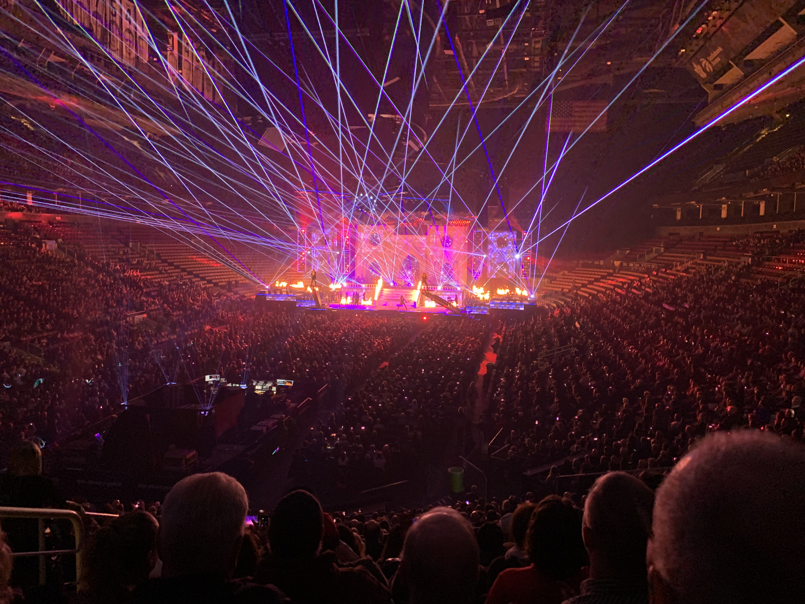
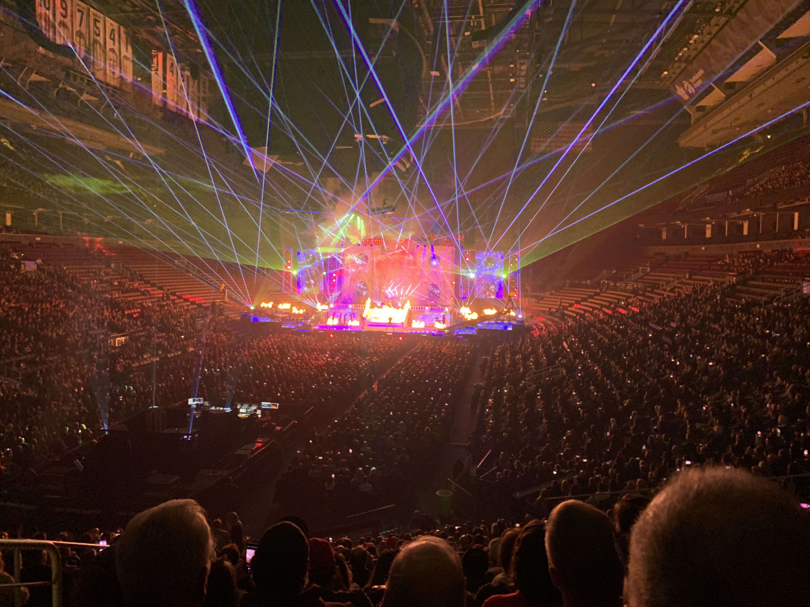

<small>February ??, 2025</small>

## Happy (belated) New Year, 2025!

I hope you are doing well as we start 2025. I had hoped to post this on January 1, so I could avoid the "belated" in the heading above ... alas, late again ... even later than usual!  It's so late this year, I can say "Happy (belated) Lunar New Year" AND "Happy (belated) Valentine's Day" 😞

2024 was ... something!  What exactly that something was is still a bit fuzzy but it was a most interesting year, between elections across the globe, new AI models, wars, talk of AI regulation, the ousting of autocrats, the election of autocrats, AI in everything, Olympics, deadly heat/floods/wildfires/hurricanes/insert-favourite-nature's-revenge-here, and AI (enough already!).  It's been confusing, worrying, exciting, terrifying.  The opening line of Dickens' "A Tale of Two Cities" is just as relevant today, maybe even more so.

> "It was the best of times, it was the worst of times, it was the age of wisdom, it was the age of foolishness, it was the epoch of belief, it was the epoch of incredulity ..."

### Track & Field 🏃

It's kinda crazy how much of our year has revolved around the training and meet schedule of the track & field club.  For almost a decade we've gone to Florida for a week, usually in May, sometimes in June and rarely in April.  The lesson from 2023 was NOT to do it in May, or in June, as Aidan missed out on representing his school in track and field during grade 7.

So, to ensure that didn't happen for his last year in elementary school, we timed our week in Florida between the end of the indoor track season and the start of the outdoor track season - a two week window in April.  It was good; the weather was pleasant, we did the Universal Studios parks (again 🤦) and didn't have issues with our flights this time!

We're happy he got the chance to compete this year ... he represented the school in 200m, 1500m, long jump and with the 4x100m relay team.  The first round is the area meet, with about 16 schools participating (the region's 110+ schools are split across eight areas).  First and second finishers in all events and some third-place finishers in the long distance races qualify to go to the regional finals.

At his school's area meet, Aidan came first in 200m, long jump and the relay, and third in the 1500m, so he qualified for the regional final in all the events!  He had kinda hoped he wouldn't qualify for the 1500m - it's his least favourite event but nobody else in the school wanted to run it!

At the regional final two weeks later, he came third in the 200m, 5th in the long jump, middle of the pack for the 1500m, and the relay team won gold!  Technically, they came 2nd but the winning team got disqualified because they passed the baton outside - well outside! - the passing zone.  Still, it was great to watch and I'm very happy he got to compete for his final year.

As for the rest of the track & field season, there was a smattering of medals, including a few with various relay teams, which are always fun to watch.  My favourite is probably the gold the team won at the Ontario championships in the medley relay - 400m, followed by two 200m segments, followed by an 800m.  By the end, they were over 100m ahead of the second place team! 🥇

Also in there was also a trip to a meet in Ohio, at an indoor 300m facility that is just incredible, putting any indoor venue we've been at in Canada to shame. 🙁

### Music 🎵

During his first semester in the 2023-2024 school year, Éamon took a keyboarding class, with a very nice teacher who really encouraged him.  That same teacher was also convinced that Éamon has "perfect pitch", the ability to recognize notes without reference to other notes or tones.  At one point, the rest of us played various tunes and asked Éamon what key they were in ... until we realized that he could be telling us anything and we wouldn't know! 🤷 Fortunately, the power of Google usually confirmed his answer as correct for almost every tune!!

So, enquiries were made about potential music teachers who might be able to work with him, and in February he started learning piano with Ms. Amanda!  We've had a Casio keyboard at home for a few years ... one of those Costco impulse purchases on my part - "wow, that seems like a deal!" - with the intent being for me to learn (ha!) to inspire Éamon to learn.  Well, the second part of that worked out, without the toil of the first part ... I would still like to learn but, you know, time ... and effort! 😞

By around May, the lessons began to require a piano pedal, and more keys (the keyboard has only 76 keys vs. a full piano's 88 keys) ... so some savings were put aside for a "proper" 88-key digital piano with pedals.  I was worried that the piano lessons, and the subsequent daily practice required, might dampen his enthusiasm for playing.  So far it hasn't - he plays daily without prompting, and if he misses a day (because we might be away, etc.), he practices twice another day!

For his last two years of elementary, Aidan out of the blue decided to join the school band and play saxophone (tenor sax in 7th grade, baritone sax in 8th grade).  For high school, he chose music as one of his elective subjects and he joined the grade 9 band! Because he took music every day for the first semester, his playing improved significantly - sitting through the high school concert was a much nicer experience than any of the elementary school ones!  ("Wow, that actually sounds like music!")

### Ireland 🇮🇪

In August, we headed to Ireland.  It had been five years since we'd last been there (thank you pandemic!).  We got to see and spend time with all my aunts and uncles ... obviously we're all five years older but it takes a different toll depending on one's stage in life.  My eldest aunt on my Dad's side is 90, and is still as sharp-as-a-knife; my eldest uncle on my Mum's side is 81, and a lot more frail than I expected.

Still, we got to have meals together, some as large as 12 people (some cousins tagged along), and it was great to catch up with them.  We were only there for about 11 days, trying to cram it in between the end of outdoor track season (of course!) and the start of school, so the focus was on family first (in case anyone on this distribution list chastises me for not reaching out while we were there!)

### Reading 📖

For the first time in well over a decade, I read more fiction (35 books) than non-fiction (24) last year!

When Michael Connelly first started publishing his Harry Bosch novels back in the 1990's, I had been a regular reader of them, usually reading them as they released.  Then, life happened, and I'd pick up one every now and then.  The books for the most part are standalone detective/crime fiction but there are references in them to previous books that made me scratch my head ... "wait, Harry sued the LAPD?", "the Lincoln Lawyer is Harry's half-brother?" ... er, spoiler alert?! 😬

So, at the end of 2023, I decided to start from the beginning and read all the Bosch books ... and Lincoln Lawyer books ... and Reneé Ballard books ... basically, they're all entertwined at this stage, like a Harry Bosch Crime Universe!  The irony?  Connelly's latest novel (*The Waiting*) was released in October ... and *that's* the one I haven't read yet!

The upshot of all the fiction books is that, by the time my Audible subscription came up for renewal in November, I still had most of the 24 annual credits unused.  So, in a panic, I went through my wish list and downloaded a slew of books.  Among them are several large (very large!) tomes.  I hadn't read anything from David McCullough before (American Pulitzer-prize-winning historian) and his books are frequently referenced by Ryan Holiday in his emails and the historical stories incorporated into his own writing.

So, I've read (listened) to *The Wright Brothers*, about their lives and how they became the first to fly.  I'm currently going through *The Path Between the Seas*, about the building of the Panama Canal - it's truly fascinating, with some wild characters, failed companies, fraud, bribery, a likely suicide (never proved), alleged spies fleeing in exile ... and that's just the French part of the story!!  It's quite the tome though - in audio form, it's 31½ hours long.  That still doesn't surpass the longest book I've listened to - Doris Kearns Goodwin's great book *Team of Rivals*, about Abraham Lincoln (41½ hours).

But that record will be broken sometime this year - in that panic of using up Audible credits, I also downloaded *Truman* by David McCullough, which is just over 54 hours! 😰  And there are three other books longer than 34 hours in the downloads ... as I said, I panicked!

So, favourite books of 2024:

- 📖 *The Opposite of Spoiled: Raising Kids Who Are Grounded, Generous, and Smart About Money* - Ron Lieber

  This is one of those books that I wish I'd read when the kids were younger, so I could have done something different around chores, money habits, etc.  Whether one agrees or disagrees with Lieber's book, the good thing about it is the discussion it should prompt on an important topic.

- 📖 *Right Thing, Right Now: Good Values. Good Character. Good Deeds.* - Ryan Holiday

  It's the third installment in his four-book Stoic Virtues series, so of course it was bought immediately!!  Like all his books, Holiday weaves together an engrossing narrative from the lives of various people to highlight the virtue under discussion (in this case, justice).  Stories from the lives of Harry Truman, Gandhi, and Jimmy Carter feature prominently in the book, as well as Florence Nightingale, Marcus Aurelius (of course!) and many others.

- 📖 *Co-Intelligence: Living and Working with AI* - Ethan Mollick

  Yes, another book about AI! (Sorry, not sorry!!)  This one is an interesting take, a bit more practical in nature, highlighting how we might be able to best use AI to our benefit.  While some educational institutions have tried banning students from using AI, Mollick, a professor at the Wharton School of Business, actively encourages his students to use it, to become very familiar with it.
  
  He highlights that we need to remember that these AI agents are *not* humans ... but then suggests that, to get the best out of them, we should treat them as if they *were* human ... wtf? 😒  Yeah, it's an interesting take!

  > I'd love to hear how folks are using AI.  For better or worse, I can't escape it day-to-day, as it's embedded into the code editor we use, and I find myself using it more and more.  By the nature of my role, I'm nearly always changing code in other teams' domains in order to customize an experience for an international market (vs. writing brand new programs).
  > AI has been quite useful in answering "how does this code work" for a highlighted section of code, which then allows me to pursue other areas to follow for understanding.  It's been useful for writing test cases (though I have also seen it go in circles and, in the end, not actually test the code I wanted to test at all!)
  > Still, it's a tool and, like any tool, it requires practice to use it well.

- 📖 *The End of Faith: Religion, Terror, and the Future of Reason* - Sam Harris

  This one might be a bit controversial!  It's a strong criticism of organized religion, and how rational thought cannot really co-exist with religious faith.  It mainly critiques the Abrahamic religions - Judaism, Christianity, Islam - with the last receiving a particularly harsh assessment in a dedicated chapter.
  
  Later in the book he criticizes the Christian right in the US and their influence on policy that is impeding both personal freedoms and medical innovation.  Although it was first published in 2004, reading it in 2024 seemed eerie, given the political climate in the US and the influence of the right at this moment in time.

  It's a very interesting read, although not everyone will agree with its sentiment - be warned!

When I start a book, I tend to finish it and I know that's a habit I need to break - there are too many great books to read to waste time forcing myself to finish a bad one.  So, for the first time in as long as I can remember, there were two books I didn't finish last year...

- 📖 *Autism Breakthrough: The Groundbreaking Method That Has Helped Families All over the World* - Raun K. Kaufman

  This one was a disappointment and I blame myself for not researching it a bit more before starting it.  It's basically a promotion of the author's parent's Son-Rise program that "cured" him of severe autism.  I found it immediately off-putting.  While progress can be made in helping folks with autism become better able to function and integrate, it's a lifelong condition ... there is no "cure".
  
  After a bit of research, I found some criticisms of the book, the chief one being that Kaufman may not actually have been diagnosed with severe autism in the first place.  So, the book was put aside - maybe there's some valuable practices in there, but it immediately struck me as a grift.

- 📖 *Think and Grow Rich* - Napoleon Hill

  Speaking of grift!  I went through way too many chapters of this one before stopping!!  Hill claimed the steel industry magnate Andrew Carnegie prompted him to research and write the book.  As the book progressed, I was waiting and waiting for the insights and started to doubt if they were going to come.  Much of it just seemed obvious in a "doh" sort of way.  It was only when I got to the chapter *The Mystery of Sex Transmutation: Use the power of your sexual energy to fuel your desire and drive.* that I stopped and said, "what the f..?!"  So, I did some quick Googling and learned:
  
  - Only Hill claims to have met and conversed "at length" with Carnegie, and only after Carnegie's death.  There's no record of them having ever met.
  - He claims to have met Carnegie in 1908 ... a year that Hill spent on the run for lumber fraud ... *FRAUD*! 🤦
  - Other than a brief encounter with Thomas Edison, there are no known documented records of his alleged meetings with all the other famous people he claims to have interviewed for the book.

  And yet, the book features on so many "must-read" lists.  The insights of having *ambition* to achieve a goal, *faith* in yourself, gaining *specialized knowledge*, using *imagination*, having *organized planning*, *decisiveness* and *persistance* all seems so obvious in 2024 ... but maybe having them codified in a list was revolutionary in 1937, when it was first published. 🤷

### Selling jewellery to a billionaire?

As an explainer for the non-Canadians, there's a take-our-kids-to-work day in early November for grade 9's during their first year of high school.  Since I work from home, does that mean Aidan would just sit beside me in the basement and watch me write code and fall asleep during video calls?  Or, head into the Town of Ajax with Susan and spend the day in HR?

No, in the end, we headed into the Shopify building downtown.  There's a team in Shopify that works with communities, including students, to promote entrepreneurship and they created an agenda for this year's *Take Our Kids To Work Day*, which included the pre-work of setting up a Shopify store.  Aidan had big ideas - such as custom, made-to-order clothing ... until he realized he didn't have the lead time to source a supplier, get samples, *and* build the website 🤦

So, he sold his mother's jewellery instead!

Well, not quite.  Susan used to be a Lia Sophia sales rep (one of these multi-level-marketing host-a-sales-event-in-your-home, or your friends' home, sort-of-thing) before Lia Sophia folded almost a decade ago, leaving us with a small inventory of necklaces, rings, bracelets, etc. We suggested to Aidan that he could build the online store to sell that ... at least it would be practice in a) building a Shopify website, and b) selling in-person at a booth.  He reluctantly agreed!

Now, ask me, "did Aidan set up the displays and unbox the jewellery to put on those displays?"  Ask me, "did he stand at the booth to make whatever sales were made that day?"

If you guessed "no" and "no", you'd be correct! 👏 No, those tasks fell to his dumbass father, while he went off to attended presentations, and Q&A sessions, and games with the other students.

*Except* for this sale ...

Afterwards I pointed out to him that he just sold about $50 worth of costume jewellery to a multi-billionaire!  With a "b"!!

It so happened that Tobi Lütke (Shopify's founder and CEO) also has a son in grade 9 and who was among the students there that day.

One of the organisers came up to me afterwards and thanked me for bringing Aidan, as he apparently asked some really good questions at the Q&A with Tobi and a panel of Shopifolk (yes, that's what we call ourselves 🤦) in the afternoon.

Needless to say, Aidan enjoyed his day wheeling-and-dealing with the elite!  He even got a tour of the floor where the Shopify Rebellion (Shopify-sponsored eSports team) hang out, practice, etc.

***I*** don't even have access to *that* floor. 😠

### Holiday experiences

For Christmas this year we wanted to reduce the number of gifts (*stuff*) for the boys and instead aimed for experiences.  In early December, we went to a screening of the movie *Elf* at Roy Thomson Hall, with the Toronto Symphony Orchestra playing the soundtrack live.

It was *really*, *really* cool!  And it highlighted just how much music is actually in a soundtrack.  We knew Éamon would like it (*Elf*'s one of his favourite movies!) but weren't too sure about "bah-humbug" Aidan!  (He enjoyed it too!)

For Christmas, my sister gifted us tickets to see the Trans-Siberian Orchestra at the Scotiabank Arena.  Nothing says "Happy Christmas" like classical and church tunes played by a hard-rock band! 🤘

Half the time the stage was on fire 🔥

And then there was the fireworks and flamethrowers set off indoors ... *INDOORS* ... during the finale 🧯

It was good.  It started loud, it ended loud ... it was the ballad-y bit in the middle that was perhaps a bit ... meh! 😒
 
### Onwards

I did a crappy job in reaching out to folks in 2024 ... sorry about that. I'll try to do better in 2025.

I typically get a few email newsletters during the week to keep me apprised on what's going on in the world.  Recently I've noticed that I'm often leaving them unread, then deleting them en masse a week or two later.  I think it's my way of avoiding news that inevitibly annoys me, or enrages me!  I find it better to try to focus as best I can on the "now", which invariably means my family.  And it's fairly easy to do, given that each day seems to be a rush ... "to where am I driving which kid now?!"

The downside of that rush is that it leads to a blur of days, and a realization later of "where has the time gone?"  I'm trying to journal daily as I find that reflection helps ... sometimes that gets put aside too, unfortunately.  It's important to slow down, especially when everything seems to get faster and faster.

Anyway, until next time, take care of yourself and your loved ones. Feel free to reach out as I'd love to hear how 2024 was for you and to catch up in general.

Regards, 
Kevin.
