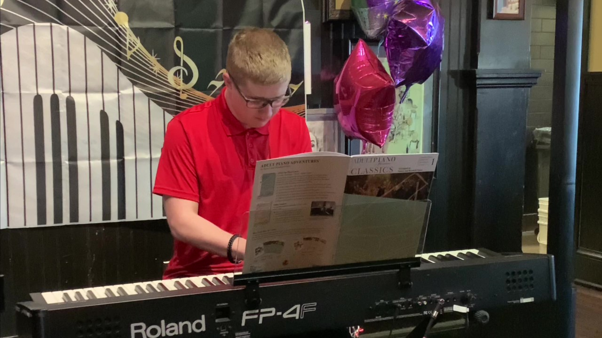
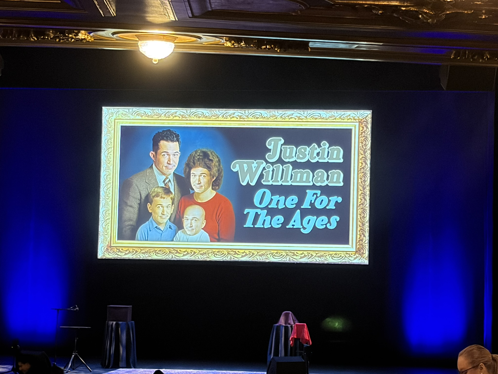

<small>January 1, 2026</small>

## Happy New Year, 2026!

I hope you are doing well as we start 2026. I actually posted one of these on January 1, finally! 😮‍💨

I opened last year's message with ...

> 2024 was ... something!

Apparently, I was wrong ... 2024 was *nothing* compared to 2025!  I'm not sure what to say about it, without turning this into a rant of unprintable epithets.

I don't know the impact the current occupant of the White House has had in Ireland, but in Canada it's had a rather galvanizing, patriotic effect.  It's been the year of `#Never51` (in response to Trump's idea to make Canada the 51st state), `#CanadaIsNotForSale` (thanks to a hat worn by Ontario's Premier Doug Ford),  and `#ElbowsUp` (courtesy of Mike Myers miming out the phrase on Saturday Night Live).  For the non-Canadian's, or just anyone not familiar with hockey (i.e., me!), let this picture explain everything ...

### Kids' extracurriculars 🏃🎵

There's not much to report here. Éamon continued his piano practice and participated in the end-of-school-year recital that his teacher hosts in June.

Unfortunately, while training with the school cross-country team at the end of 2024, Aidan injured his foot, then had issues with a knee, then a hip, then the other hip ... he basically spent the majority of the track & field season injured and unable to compete.  All because the geniuses leading the school cross country team trained on *pavement*, rather than grass ... you know, the stuff that cross-country runners actually run on!  For the outdoor season, Aidan didn't participate in any of the competitions.  There was a lot of sports massage/physiotherapy to try to fix him up!

The indoor track season is now underway and he had his first meet in mid-December ... he knocked over half-a-second off his previous PB in the 200m, so ... 🤞

As for Aidan and music, he attended one morning practice for band - he was so early for it, the teacher wasn't even there yet - and then decided that he didn't want to do it any more. 🤦  In November, like any delusional teenager, he joined a band, as the singer, despite never singing in public before!  Some of the band members wanted to participate in the talent show in December despite

- never practicing together as there was always someone missing,
- their singer never practicing because the microphones in the practice room didn't work, and 
- arguably not having a lick of talent between them!

With this historic track record, Aidan decided to quit the band when he learned they wanted to do a cover of a "god-awful emo song from some band named Weezer" 🤣. Can you really quit a band that never once practiced together ... 🤔

### Job hunting ... again!

Towards the end of 2024, the team I was on was split into two - my previous manager retained a little over half the team, and me and a few others started reporting to a new manager.  In March, my former manager was let go, in April one of my colleagues left, and in May, I was also "right-sized", to use the euphemism.  Unlike 2022 or 2023 when Shopify did large 10% or 20% of workforce layoffs, these days there's a steady stream of layoffs, as the company is "all-in" on AI and opportunities to cut costs are paramount.  I chatted with my previous manager in early December and he mentioned there's been 8 or 9 director-level folks who're no longer with Shopify (including our own former director) and some very senior folk are also no longer there.  It's a company undergoing a major shift in culture ... and perhaps not for the better.

So, in May, I started the job hunt again.  Several of the folks reading this already know, as I emailed asking to keep an eye out for anything they thought might be suitable.  In June, one of them replied asking, "hey, I've got a problem, would you mind doing a short term contract to take a look?"  I said, "sure, would love to" ... and thus I ended up working at TELUS, again!

While the company is obviously different (it's been seven years, after all!), it's been surprisingly easy to slot back in, in a welcoming, comfortable sort of way - maybe because it's with a team I was part of for so long.  Anyway, thanks to J&J (you know who you are!!) for keeping me out of trouble for the second half of the year!

### Vacation

Because of a bit of Canadian pride (`#ElbowsUp`), we did not venture to Florida this year, much to Éamon's consternation.  We've gone there every spring since 2012, except for the pandemic years.  At least for the pandemic years we were able to explain to him why we couldn't ("we not allowed!") but deciding to not go voluntarily was a little more challenging to explain.

Instead, we decided to head to Halifax during the summer, and convinced my sister in Ireland to meet us there.  She'd not been there, the boys hadn't been there, and Susan and I hadn't been there since before the boys were born.

Everything was looking good until the Air Canada flight attendants went on strike 🤦  After the fiasco with Air Canada two years ago on the return flight from Florida, we didn't want to fly with them again, but their arrival times lined up better with my sister's arrival from Ireland, so we said "what the heck".  In the days leading up to it, we paid closer attention to the news and, sure enough, they gave their 72 hour notice on the Wednesday before our Saturday morning flight.  Well, f%@&! 😡

We knew there would be few other flights available so our only options were to cancel (which wasn't fair on my sister) or to drive.  In anticipation of driving, Susan suggested to get the car serviced.  Wouldn't you know it, the brakes needed a full service!  In fairness, the kilometers on the car were at that point where it is supposed to be done anyway but still, it just sucked to have a very hefty bill before our trip ... a trip where we'd have to spend on some extra hotels for the journey, etc.

The road trip wasn't bad, really.  We split it into two days on the way there and three days on the way back, and it was very straight-forward.  The road surface was mostly good, except for a section of the highway in Quebec.  Plenty of batteries to power phones, movies loaded on to an iPad, and Susan and I listened to a bunch of episodes of the SmartLess podcast (mindless entertainment!).

In Halifax, we did a bunch of museums, got to see the Bluenose II in Lunenberg, went to see the ubiquitous Peggy's Cove lighthouse, and ate some ridiculously delicious seafood chowder in Mahone Bay!  The weather was also very nice.  I was amazed at the amount of construction - buildings, neighbourhoods, highways - around the city since we had last been there.  It seems like a city expanding in a hurry.

### Reading 📖

If there's a theme to the books I've read/listened to in 2025, it's *history*.  I've gone through 33 non-fiction books this past year (not quite - there's one I didn't finish!), with several from the same few authors:

- David McCullough (5): The Wright Brothers, The Path Between the Seas, Truman, John Adams, History Matters
- Walter Isaacson (5): The Code Breaker, Leonardo da Vinci, Kissinger, Benjamin Franklin, Einstein
- Ben Macintyre (5): Prisoners of the Castle, For Your Eyes Only, The Siege, The Spy and the Traitor, Agent Sonya
- Doris Kearns Goodwin (3): No Ordinary Time, The Bully Pulpit, Leadership

All four authors are fantastic writers, though Macintyre is probably my current favourite - he's a great storyteller and when he narrates his own audiobooks, they're just marvelous!

So, putting those books aside and selecting others as favourites of 2025:

- 📖 *Be Useful* - Arnold Schwarzenegger

  The title comes from advice his father gave him, and Schwarzenegger expounds on seven ingredients to *be useful* - vision, big thinking, work ethic, influence, adaptability, open-mindedness, contribution.  It's surprisingly well written (I'm not sure if there was a ghost writer involved) and basically highlights the importance of finding your purpose, being resilient, continuously improving, being helpful to others ... you know, the common sense stuff ... but it draws on his life and experiences, which makes it an entertaining read also.

- 📖 *Wisdom Takes Work* - Ryan Holiday

  The fourth and final installment in his Stoic Virtues series, Holiday pulls stories from the lives of Abraham Lincoln, Maya Angelou, Montaigne, and Elon Musk (in a cautionary way!) to discuss the virtue of wisdom.  Like his many other books, it's a tapestry woven from the lives of interesting people and, as always, very well put together.

- 📖 *The Body: A Guide for Occupants* - Bill Bryson

  It's been years since I read a Bill Bryson book.  I think the last one was *A Short History of Nearly Everything*, which is brilliant and witty. *The Body* similarly doesn't disappoint.  Lots of interesting bits about the body and what we know (and what we don't!) but I suppose my main takeaway is how some of the scientists who made great discoveries in medicine and physiology were not very nice people.  For example:

  - Henry Gray, he of *Gray's Anatomy* (the book!) fame, argued with the publishers to reduce the size of the characters of Henry Vandyke Carter's name, who was the illustrator of the book and who performed many (if not most) of the dissections required to create the detailed illustrations for which the book is famous.  It's arguably why it's known to us today as *Gray's Anatomy* and not *Gray's and Carter's Anatomy*!

  - The discovery of insulin is heralded as one of the great contributions of Canada to the world of medicine, with the 1923 Nobel Prize in Physiology or Medicine being awarded to Frederick Banting and John Macleod.  However, within a few years of the discovery the four people involved - Banting, Macleod, the lab assistant Charles Best and a biochemist named James Collip - had all fallen out with each other.  Macleod apparently wasn't really involved but because he was the head of the lab involved, his name was added to the paper and, as a result, he got recognized with the Nobel Prize.  Best wasn't acknowledged at all, which outraged Banting - he shared his Nobel Prize money with him.  Macleod did likewise with Collip, only for Collip to attempt to claim the purification patent for himself. In the end, none of them were talking to each other. 🤦
  
  And there were plenty of other examples of scientists being thoroughly insenstive to people throughout the book!  For the drama alone, it's a good book!!

### October baseball

For the month of October, we all became Toronto Blue Jays fans, who advanced to the post-season for the first time since 2022, and kept us all yelling at the TV with multiple comebacks to proceed all the way to game 7 of the World Series against the LA Dodgers.  The baseball in October was exciting, even thrilling at times ... November baseball (game 7 was on Nov 1), not so much 😞  We don't talk about November baseball...

### Holiday experiences

Following last year's trip to see the movie *Elf* at Roy Thomson Hall, with the Toronto Symphony Orchestra playing the soundtrack live, we returned to see *Home Alone* in early December, albeit only with Éamon (*Home Alone* IS his favourite Christmas movie!).  And like last year, it was very enjoyable.  The second half of the performance included a choir (there's a choir scene in a church in the movie) and that was really amazing. (You can see the choir behind the screen in the second photo.)

The following night, we all went to see magician/comedian Justin Willman's *One for the Ages* tour.  That was a lot of fun!

Earlier, in September (so not really a "Christmas holiday" experience!), we also went to see Gabriel "Fluffy" Iglesias - that was a very funny night!  If you haven't seen his comedy specials on Netflix, you should check them out!!

### Onwards

From last year ...

> I did a crappy job in reaching out to folks in 2024 ... sorry about that. I'll try to do better in 2025.

Nope!  Did even worse in 2025 😞  I guess I'll have to try to double-down on the effort in 2026.

Another theme for 2025 was recovery, like Aidan's recovery and rehabilitation from injury already mentioned.  Early in the year, both boys had finished their braces/aligners, so they also had their wisdom teeth removed, surgically.  Aidan in April, Éamon in September, which meant about a week of recovery each and then many more weeks of oral care to avoid complications.

In mid-November, Éamon came home with the flu, which Susan promptly got, and that knocked them both sideways for about a week, with a long-lingering cough.  In mid-December, both of them were knocked sideways with it again, and they're still recovering from that bout of flu.  How Aidan and I didn't get it is kind of a miracle!

Anyway, if you've made it this far, thanks!  Take care of yourself and your loved ones and please let me know how 2025 was for you and to catch up in general.

Regards, 
Kevin.
